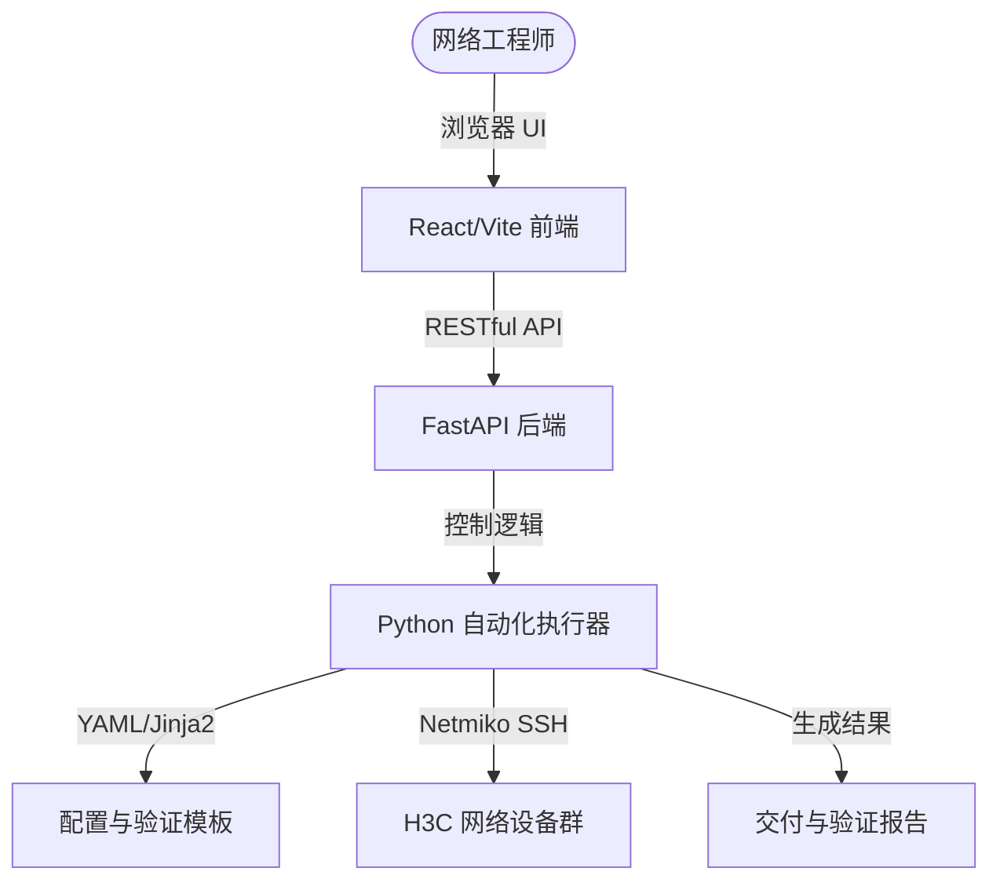

# NetDevOps 自动化运维平台

[](https://python.org)
[](https://fastapi.tiangolo.com)
[](https://react.dev)

> **NetDevOps 不仅仅是“写几个脚本省时间”，而是将网络运维转化为一种可复用、可验证、可审计、持续改进的软件工程流程。**

本项目旨在打造一个轻量化、现代化的 NetDevOps 网络自动化交付与运维平台。它包含了直观美观的 Web 前端管理界面与强大的 Python 自动化执行引擎，专为网络工程师交付与日常运维设计。

---

## 🌟 核心设计理念

传统的网络运维依赖人工敲命令，效率低且容易出错。本项目倡导 **Network as Code (网络即代码)**：
1. **输入结构化**：所有的设备清单、配置参数使用 YAML/JSON 格式进行结构化存储。
2. **配置模板化**：使用 Jinja2 模板生成标准 CLI 配置，实现配置内容与代码逻辑解耦。
3. **闭环验证 (Closed-Loop Validation)**：不仅执行“下发命令”，更包含“下发前校验”与“下发后 display 状态匹配”，实现 **输入 → 渲染 → 下发 → 验证 → 报告** 的闭环流程。

---

## 🛠️ 首期核心应用场景 (H3C 专属交付)

首期以 **H3C (华三)** 设备为核心目标，实现以下三大支柱工具：

### 1. H3C Base Init Tool (交付自动化)
实现设备的标准化初始化与基础管理配置，包括：
* 批量创建本地用户 (Local User)，自定义用户名、密码与权限级别 (Privilege Level)。
* 统一启用基础服务：LLDP、SSH、Telnet、STP (生成树协议)。
* 配置 NTP 服务端与时区偏移（例如欧洲中部时间 CET、北京时间 CST 等）。
* 配置管理 VLAN、管理 IP 地址及默认路由。

### 2. H3C Validation Tool (验证自动化)
配置下发后，自动收集状态并比对预期，确保配置生效：
* 执行 `display current-configuration | include local-user` 确认用户存在。
* 执行 `display ssh server status` 确认 SSH 开启。
* 执行 `display lldp status` 确认 LLDP 运行状态。
* 执行 `display ntp-service status` 验证时钟同步。
* 执行 `display stp brief` 验证生成树状态。
* 通过关键字匹配算法自动分析输出 `PASS` / `FAIL` 状态。

### 3. H3C Delivery Report Tool (审计与报告)
自动生成可追溯的交付结果：
* **配置预览 (Config Preview)**：下发前展示即将执行的命令。
* **执行日志 (Execution Log)**：每台设备的连接、执行状态和耗时。
* **验证结果 (Verification Result)**：汇总展示每个检查项的通过率，支持导出为 TXT/CSV/PDF 交付报告。

---

## 🚀 平台架构与技术栈

本平台采用**前后端分离**架构，支持本地单机运行或多用户网页访问。



* **前端 (Frontend)**: React + Vite + Vanilla CSS (极简科技风，深色模式，响应式仪表盘)
* **后端 (Backend)**: Python FastAPI + Uvicorn
* **网络驱动 (Network Driver)**: Netmiko (基于 SSH 协议)
* **模板引擎 (Template Engine)**: Jinja2
* **数据格式 (Data Format)**: YAML (资产与配置) / JSON (API 传输)

---

## 📅 项目演进路线图 (Roadmap)

* [ ] **v1.0 (最小可行性版本 - MVP)**: 单设备、单脚本执行。支持基本的 YAML 参数加载，通过 Netmiko 完成 H3C 设备初始化、验证并生成 TXT 结果报告。
* [ ] **v2.0 (批处理版本)**: 引入多线程/协程并发，实现多台设备批量初始化与巡检。
* [ ] **v3.0 (模板仓库化)**: 丰富模板库，支持 AAA、SNMP、OSPF、VLAN 等多种业务场景模板。
* [ ] **v4.0 (幂等与预检)**: 实现下发前状态预检，避免重复配置，确保操作安全幂等。
* [ ] **v5.0 (GitOps 融合)**: 将配置参数纳入 Git 仓库，实现配置版本追踪，可通过 CI/CD 自动触发下发。
* [ ] **v6.0 (可视化平台)**: 推出基于 React 的 Web 可视化看板，提供设备状态监控、一键下发和报表导出。

---

## 📝 快速开始 (即将推出)

### 后端准备
1. 安装 Python 3.9+。
2. 安装依赖包：
   ```bash
   pip install -r backend/requirements.txt
   ```
3. 启动 API 服务：
   ```bash
   uvicorn backend.main:app --reload
   ```

### 前端准备
1. 安装 Node.js (推荐 v18+)。
2. 进入前端目录并安装依赖：
   ```bash
   cd frontend && npm install
   ```
3. 启动开发服务器：
   ```bash
   npm run dev
   ```

---

## 📄 许可证
本项目采用 MIT 许可证开源。
