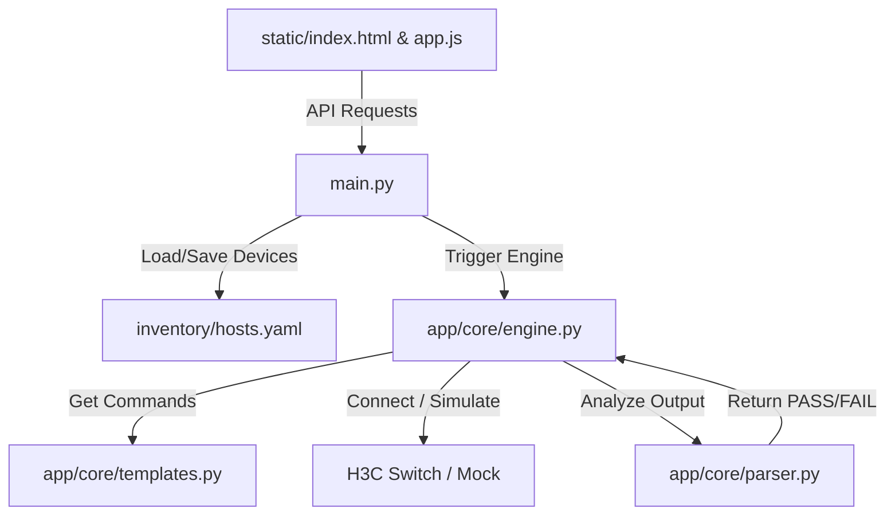

# NetDevOps 自动化平台开发指南 (development.md) - v1.0 MVP

本项目旨在建立一个轻量、高效的网络自动化部署与运维工具。本文档用作项目开发逻辑索引，详细记录了当前系统的代码架构、本地控制台工具（如 PuTTY）的集成方案、未来功能需求追踪及详细的设计实现思路。

---

## 1. 代码逻辑与文件映射

目前整个平台的框架由 FastAPI 后端及 Vanilla UI 前端组成。文件之间的依赖与职责划分如下：



### 核心文件解析
1. **[backend/main.py](file:///f:/One%20Drive%20Personal/OneDrive/03_Learning/08_Vibcoding/01_Netwdevops/backend/main.py)**:
   * **职责**：项目入口，负责启动 Web 服务器。
   * **关键逻辑**：定义 Pydantic 数据校验模式；提供 `/api/devices` 增删改查路由；提供配置下发 `/api/run-init` 与状态验证 `/api/run-verify` API 端点；最终将前端页面静态目录 `backend/static` 挂载在根目录。
2. **[backend/app/core/engine.py](file:///f:/One%20Drive%20Personal/OneDrive/03_Learning/08_Vibcoding/01_Netwdevops/backend/app/core/engine.py)**:
   * **职责**：核心执行引擎。
   * **关键逻辑**：实现 SSH 与 Mock 驱动。当设备配置中 `is_mock: true` 或系统环境变量 `MOCK_DEVICES=true` 时，引擎会生成模拟的 CLI 会话日志和设备回显。若为真实环境，则调用 `netmiko.ConnectHandler` 建立真正的加密 SSH 隧道，逐行下发配置，并执行 `save force` 保存。
3. **[backend/app/core/templates.py](file:///f:/One%20Drive%20Personal/OneDrive/03_Learning/08_Vibcoding/01_Netwdevops/backend/app/core/templates.py)**:
   * **职责**：配置与验证命令模板库。
   * **关键逻辑**：存放 Jinja2 文本模板（如 `INIT_TEMPLATE`）和校验命令映射表（`VERIFICATION_COMMANDS`）。利用 Jinja2 逻辑控制（如 ``）动态组合需要执行的命令行。
4. **[backend/app/core/parser.py](file:///f:/One%20Drive%20Personal/OneDrive/03_Learning/08_Vibcoding/01_Netwdevops/backend/app/core/parser.py)**:
   * **职责**：解析回显文本。
   * **关键逻辑**：通过正则表达式和关键字检索对 `display` 命令的返回信息进行匹配。比如对于 SSH 检测，识别输出中是否包含 `enabled`，满足则返回 `True` (PASS)，不满足则返回 `False` (FAIL)。

---

## 2. 本地控制台与 PuTTY/Serial 接入指南

网络工程师常在本地使用 PuTTY 或串口线直连调试设备。我们的平台在本地运行，可以通过以下机制与本地物理工具或端口进行对接：

### 2.1 PuTTY 本地调用规范
PuTTY 是 Windows 系统中最常用的终端软件。默认的安装路径一般为：
* **64位系统默认路径**: `C:\Program Files\PuTTY\putty.exe`
* **32位系统默认路径**: `C:\Program Files (x86)\PuTTY\putty.exe`

#### A. 命令行直接拉起 SSH
如果您希望通过本地平台一键唤醒本地 PuTTY 去连接指定设备，可以通过 Python 执行以下系统命令（注意参数间的空格）：
```powershell
# 语法
putty.exe -ssh <用户名>@<设备IP> -pw <密码> -P <端口>

# 示例
"C:\Program Files\PuTTY\putty.exe" -ssh admin@192.168.1.1 -pw admin123password -P 22
```

#### B. 命令行直接拉起 Serial (串口线)
当使用 USB 转 Console 线连接设备时，可以使用 PuTTY 的串口连接模式：
```powershell
# 语法
putty.exe -serial <COM端口> -sercfg <波特率>,<数据位>,<奇偶校验>,<停止位>,<流控>

# 示例 (连接COM3，波特率 9600，无奇偶校验，1位停止位，无流控)
"C:\Program Files\PuTTY\putty.exe" -serial COM3 -sercfg 9600,8,n,1,N

# 示例 (连接COM1，波特率 115200)
"C:\Program Files\PuTTY\putty.exe" -serial COM1 -sercfg 115200,8,n,1,N
```

### 2.2 实时控制台屏显如何与 PuTTY 对应？
由于 Web 浏览器是运行在沙箱中的，**无法直接将 Windows 本地 PuTTY 应用程序的窗口画面渲染到 Web 网页内部**。为了解决这个问题，在 v1.0 中，我们设计了两种替代/补充方案：

1. **后端代理会话（Netmiko Interactive Channel）**：
   * **原理**：后端的 `Netmiko` 实际上已经创建了一个标准的 SSH 交互会话，它能收到与 PuTTY 屏幕一模一样的文本回显（包括终端提示符如 `<H3C>`、输入命令的换行等）。
   * **实现**：我们将 Netmiko 的交互式读写内容保存为日志文本（或未来通过 WebSocket），并在前端的“实时日志控制台”（类似 Web 终端）中动态渲染出来。这在效果上等同于“在网页上显示 PuTTY 的文本内容”。
2. **现代浏览器 Web Serial API 直接接入串口**：
   * **原理**：现代浏览器（如 Chrome, Edge）支持 Web Serial 技术，允许前端 JavaScript 直接申请读写用户电脑上的物理 COM 口（USB 串口线）。
   * **优点**：无需安装或拉起 PuTTY。网络工程师直接在 Web 网页里选择本地 `COM3`，授权后即可直接在网页上向串口发命令，实现“零 PuTTY 客户端”的一键串口开局。

---

## 3. 开发功能需求与追踪表格 (v1.0)

| 编号 | 功能模块 / 需求描述 | 状态 | 目标版本 | 备注 |
| :--- | :--- | :---: | :---: | :--- |
| **1.1** | 设备资产 YAML 本地存储与读写接口 | `[x]` | v1.0 | 存储在 [hosts.yaml](file:///f:/One Drive Personal/OneDrive/03_Learning/08_Vibcoding/01_Netwdevops/backend/inventory/hosts.yaml) |
| **1.2** | H3C 设备基础初始化（用户、SSH/Telnet、LLDP、STP、NTP）命令行渲染与下发 | `[x]` | v1.0 | 已实现 Jinja2 动态拼接 |
| **1.3** | H3C 设备状态 display 校验与解析算法（PASS/FAIL） | `[x]` | v1.0 | regex 匹配核心 display 状态 |
| **1.4** | 前端科技感 UI 仪表盘（设备清单 + 参数表单 + 终端控制台 + 结果卡片） | `[x]` | v1.0 | 采用原生单页，无需构建工具 |
| **1.5** | **完善本地接口与 PuTTY 唤醒接口** | `[ ]` | v1.1 | 后端开发 API，一键拉起 Windows 本地 PuTTY |
| **1.6** | **网页内置 Web Serial 串口调试终端** | `[ ]` | v1.1 | HTML5 串口调用，直接读写本地 COM 口 |
| **2.1** | **封装 IRF 智能堆叠配置 API 向导** | `[ ]` | v1.2 | 多台设备协同，先收集 hostname，后选择 Master，计算各自 Member ID 与 Priority，下发物理端口绑定，并执行状态闭环验证 |
| **3.1** | **多厂商适配器设计 (Huawei, H3C, Cisco, Aruba)** | `[ ]` | v1.3 | 引入多厂商适配器接口层，解耦 CLI 命令行模板与检测器 |

---

## 4. 重点功能设计流向 (IRF 堆叠向导)

IRF (Intelligent Resilient Framework) 是 H3C 设备的堆叠技术。因为涉及到多台物理设备合并，自动化步骤必须设计为分步闭环流程：

```mermaid
sequenceDiagram
    autonumber
    actor Engineer as 网络工程师
    participant Web as 前端 UI (IRF 向导)
    participant API as 后端 FastAPI
    participant Sw1 as Switch A (真机/模拟)
    participant Sw2 as Switch B (真机/模拟)

    Engineer->>Web: 输入堆叠设备IP/账号 (多台)
    Web->>API: 提交多设备连接请求
    API->>Sw1: 建立连接并获取 hostname
    API->>Sw2: 建立连接并获取 hostname
    API-->>Web: 返回设备基本信息列表
    Note over Web: 界面展示机器列表，工程师确认堆叠参数
    Engineer->>Web: 1. 选择 Switch A 为 Master<br/>2. 确认各自 Member ID (1, 2)<br/>3. 设置 Priority (如 32, 1)
    Web->>API: 下发 IRF 详细配置请求
    
    rect rgb(30, 41, 59)
        Note over API, Sw1: Switch A (Master) 配置段
        API->>Sw1: 1. 修改 Member ID 并重启 (若需要)
        API->>Sw1: 2. 关闭准备绑定的物理接口 (GigabitEthernet 1/0/1 等)
        API->>Sw1: 3. 创建 irf-port 1/1, 将物理接口 bind 进组
        API->>Sw1: 4. 开启物理接口 (undo shutdown)
        API->>Sw1: 5. 激活 IRF 配置 (irf-port-configuration active)
    end
    
    rect rgb(30, 41, 59)
        Note over API, Sw2: Switch B (Member) 配置段
        API->>Sw2: 重复上述步骤 (Member ID 改为 2, 创建 irf-port 2/2 并绑定对应接口)
    end

    Note over API: 等待设备自动加入堆叠并同步重启
    API->>Sw1: 轮询连接，执行 display irf 并解析
    API-->>Web: 回显堆叠拓扑结构，返回配置验证 PASS/FAIL
```



* **异常自动纠错 (Self-Healing)**：如果在第 9 步 `display irf` 发现拓扑依然是 Split（分裂）状态或端口状态为 DOWN，平台将自动收集 `display irf link` 和 `display interface brief`，检查是否由于“物理端口未 Undo Shutdown”、“物理端口与逻辑 IRF 端口索引配错”引起，并在页面给出具体的修复指令，或在安全授权下自动回滚/修正配置。

---

## 5. 多厂商适配器设计 (Multi-Vendor Factory)

为了使项目未来能够扩展支持 **华为 (VRP)**、**思科 (Cisco IOS)** 和 **Aruba (AOS-CX)**，我们将引入工厂模式（Factory Pattern）重构配置引擎：

```
backend/app/core/
│
├── __init__.py
├── engine.py                 # 全局调用入口 (获取对应的 Vendor Adapter)
│
├── adapters/                 # 厂商适配器目录
│   ├── __init__.py
│   ├── base.py               # 抽象基类 (定义 render_config, parse_display 接口)
│   ├── h3c.py                # H3C 厂商实现
│   ├── huawei.py             # 华为 厂商实现
│   ├── cisco.py              # 思科 厂商实现
│   └── aruba.py              # Aruba 厂商实现
```

### 接口定义示例 (adapters/base.py)
```python
from abc import ABC, abstractmethod

class BaseNetworkAdapter(ABC):
    @abstractmethod
    def get_init_commands(self, params: dict) -> list:
        """根据输入参数，渲染出对应厂商的 CLI 配置命令列表"""
        pass

    @abstractmethod
    def get_verification_commands(self) -> dict:
        """获取对应厂商的 display/show 状态检查命令字典"""
        pass

    @abstractmethod
    def parse_status(self, check_key: str, cli_output: str, params: dict) -> bool:
        """根据 check_key 解析命令回显结果，返回 PASS 或 FAIL"""
        pass
```
这样，主引擎 `engine.py` 只需要根据设备类型 `device_type`（如 `huawei_vrp`、`cisco_ios`）动态实例化子类，便可实现“一套核心逻辑，适配多个品牌设备”的优雅架构。
